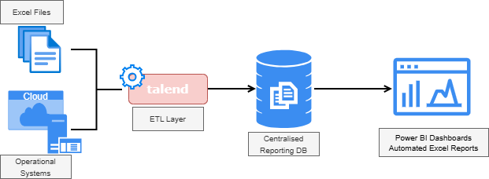
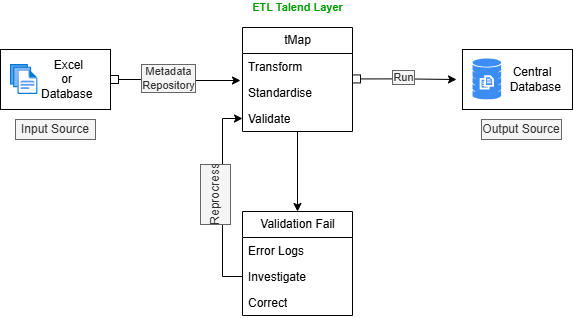
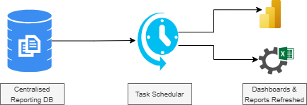

# 🗂️ Centralized Reporting & Data Integration

## Overview

During my time as a Management Trainee - Business Analyst in the non-banking financial services industry, I contributed to ETL workflows that supported the development and maintenance of a centralized reporting environment.

This repository presents a conceptual case study inspired by that experience. While all examples, diagrams, and workflows have been anonymized and simplified, they reflect the practical challenges involved in integrating data from multiple business functions into a trusted reporting ecosystem.

The initiative aimed to reduce reporting dependencies across departments, improve reporting consistency, and provide a centralized source of information to support both operational reporting and executive decision-making.

---

## Business Context

Like many growing organizations, reporting information was generated across multiple departments and operational platforms.

Examples included:

* Loan reconciliation files maintained by the Accounts department
* Sales and disbursement reports maintained by Business departments
* Collections and recovery reports
* Risk and portfolio monitoring reports
* Digitized operational records converted from manual processes

While each department had its own reporting requirements, many reports depended on information produced by other teams.

As reporting volumes increased, this created operational challenges:

* Teams waiting for upstream reports before completing their own analysis
* Manual reconciliation across multiple spreadsheets
* Multiple versions of the same information
* Inconsistent KPI definitions
* Increased effort to validate reported figures

---

## The Solution

The long-term objective was to create a centralized reporting environment that could serve as a trusted foundation for reporting across business functions.

This involved:

* Integrating data from multiple sources
* Standardizing reporting logic where appropriate
* Documenting KPI definitions and business rules
* Automating data movement and report refresh processes
* Supporting a single source of truth for enterprise reporting

### Centralized Reporting Architecture

The centralized database acted as the integration layer between operational systems and reporting outputs, supporting both Power BI dashboards and automated Excel-based reporting.

---

## Data Integration & ETL Workflows

### ETL Workflow Overview

Talend Open Studio was used to support data integration workflows between files, databases, and reporting environments.
Common integration scenarios included:

### Excel → Excel

Transforming and standardizing operational spreadsheets into reporting-ready outputs.

### Excel → Database

Loading spreadsheet-based business information into centralized reporting structures.

### Database → Database

Moving and transforming data between operational systems and reporting databases.

Key concepts I worked with included:

* Metadata-driven job configuration
* Schema management
* tMap transformations
* File and database integrations
* Job execution, scheduling, and monitoring
* Reporting data validation

---

## KPI Governance & Data Quality

### KPI Governance

One challenge encountered during reporting integration was that the same KPI could be interpreted differently across business functions.

For example, metrics related to portfolio quality and delinquency could be viewed differently by the Risk, Collections, and Accounts teams because each function focuses on different operational objectives.

As reporting became more centralized, KPI definitions, data sources, bucket classifications, and business rules were reviewed and documented to improve transparency and reduce ambiguity in reporting outputs.

This experience highlighted the importance of:

* Data governance
* KPI standardization
* Business rule documentation
* Metadata management
* Cross-functional collaboration

### Data Quality Controls

ETL workflows also served as an important validation layer.

Common issues included:

* Data type mismatches
* Missing values
* Invalid formats
* Schema inconsistencies
* Source file issues

When failures occurred, ETL logs and validation checks were used to investigate root causes and determine whether corrections were required in source files or transformation logic before reprocessing.

---

## Reporting Automation

### Automated Reporting Lifecycle

Once the data was integrated into the centralized reporting database, reporting outputs could be refreshed automatically through scheduled processes.

This supported:

* Automated Power BI dashboard refreshes
* Automated Excel report refreshes
* Faster access to operational information
* Reduced manual reporting effort

Rather than recreating reports manually, teams could focus more on analysis and decision-making.

---

## My Contribution

Senior members of the Business Intelligence team led this initiative.

My role focused on supporting and maintaining ETL workflows that contributed to the centralized reporting environment.

Responsibilities included:

* Running and monitoring Talend jobs
* Supporting data movement between files and databases
* Executing SQL queries for validation and troubleshooting
* Replicating established transformation logic
* Investigating ETL failures and schema mismatches
* Validating reporting outputs
* Supporting automated report refresh processes

While I was not responsible for the overall architecture design, this experience provided practical exposure to enterprise reporting operations, ETL workflows, data quality controls, reporting governance challenges, and cross-functional reporting requirements.

---

## Outcomes & Learnings

Contributing to centralized reporting initiatives reinforced several important data management principles:

* Reporting challenges are often business challenges before they become technical challenges.
* Automated reporting reduces operational dependencies and reconciliation effort.
* Centralized reporting environments improve cross-functional visibility and decision-making.
* Consistent KPI definitions are essential for trusted reporting.
* Metadata-driven development improves maintainability and consistency.
* Data integration and data governance must evolve together.

Most importantly, I learned that creating a trusted reporting environment is about ensuring that people across the organization can make decisions using consistent, reliable information, and not simply about moving data between systems.

---

## Tools & Technologies

| Area             | Exposure                                                            |
| ---------------- | ------------------------------------------------------------------- |
| ETL              | Talend Open Studio, Metadata Repository, tMap                       |
| Data Integration | Excel-to-Excel, Excel-to-Database, Database-to-Database             |
| Validation       | Schema checks, data quality investigations, error logging           |
| Reporting        | Automated Excel reports and Power BI dashboards                     |
| Database         | SQL querying, validation, troubleshooting                           |
| Governance       | KPI standardization, reporting consistency, business rule documentation |

---

## ❗️Disclaimer

This repository presents a conceptual case study inspired by professional experience supporting centralized reporting and ETL workflows within a financial services environment.

All examples, diagrams, workflows, and descriptions have been anonymized and simplified for educational and portfolio purposes. No proprietary systems, business logic, data structures, or confidential information are included.
